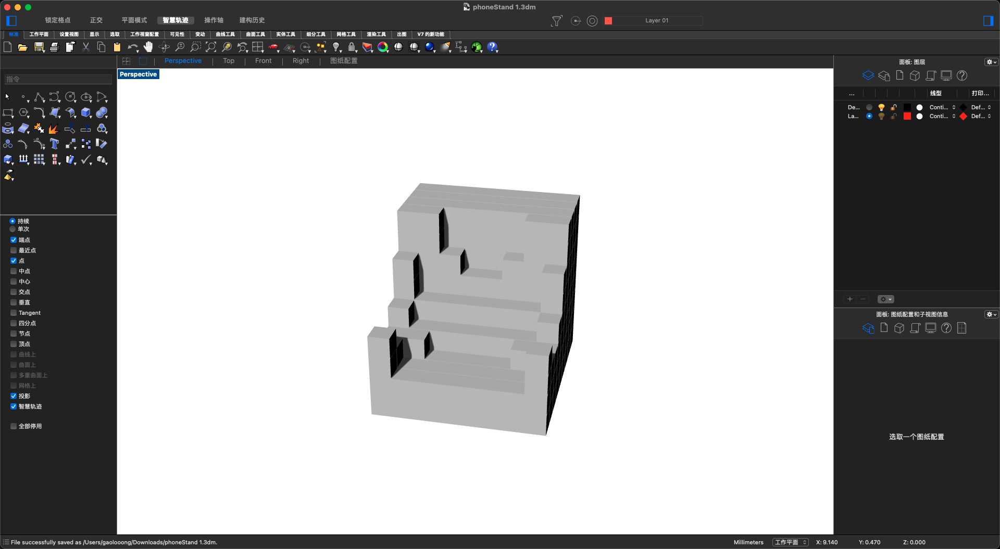
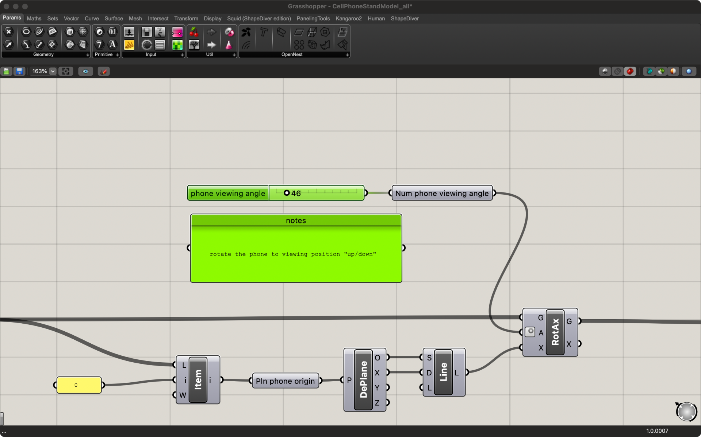

# **Report 16- Week of 12/14/2023**

For this term, I think I’ve learned a lot about the technology and have a lot of experience about developing a interactive project. I think maybe in next term, I want to explore more about the design. I love this course.

# **Report 15- Week of 12/07/2023**

## Final Project - Chameleon Assistant

Chameleon Assistant is a physical table assistant which has an adaptable character traits based on LLM. It could interact with users through voice and assist users to arrange their work.

## Challenges

1. Using OpenAI’s latest API to develop an assistant of engaging in real time dialogues like speech to text API, assistant API, etc.
    
    We implement some functions like recognize selected words(timer, remind, minute...) to help users to set a timer, press button to record the voice file, send and receive message from openAI, etc…
    

    
2. **We tried to overcome the problem that our Chameleon assistant, which based on chatGPT, cannot proactively remind users about events.**
    
    To overcome this limitation we started exploring ways to prompt GPT to generate reminders. During our experiments we discovered that by adding the word "reminder" before a message and using sentences like "Reminder: Check if it's time to notify the user that their timer has ended. " we could achieve the desired effect.
    

    

    
3. **Physical Model：We try to achieve motion while minimizing structures.**
    
    In the Physical Model stage, we tried to simulate a more vivid effect with a minimum number of motors. So we designed the current physical model, we use two directions of motors, head and torso, and use this as the basis for robot motion design.
    

    
4. **Connecting Photon and Python**
    
    We have also designed three motion modes aligned with the states in the Python state machine, "Listening", "Speaking", and "Standing By" mode. Then we utilized particle events to establish a connection from Python to Photon.
    

    


## Display


## Speculations

### How the technologies you explored will impact the design of human experiences

The unexpected speed of AI development makes the "digital bespoke era" possible. We believe, in the near future, everything, such as mobile APPs, Smart furniture, will all become bespoke for each individual. That’s the reason we explore chameleon assistant, it represents not only the intelligence of the machine, but also the understanding of the user, it can be adapted to our needs and customized for each individual.

### How the technologies you explored will impact engineering and how we build.

Regarding engineering, it does show the hint that a table robot can unconsciously enhance people's sense of time management and boost work efficiency. We think the movement of our table robot can also be fully customized, depending on the user's mood.

## Conclusion

In conclusion, we have explored how to use ChatGPT to help us to program, and how to connect LLM with a physical model through a microcontroller. We believe this will greatly promote our future works.

# **Report 14- Week of 11/30/2023**

Based on our project, a Table Assistant which has adaptable character, I draw a status diagram. I need to combine the user's behavior with the robot's behavior.


Further to this, I explored OpenAI's Speech to text API and text to speech API, I add the two APIs into my project function. I wrote most of the code in python, but haven't connected the python program to photon yet.


# **Report 13- Week of 11/23/2023**

 After watching the showcase of OpenAI, I and my teammate Yang decided to use the latest OpenAI API and feature. So I start to try how to use the new Assistant Feature and API.


- New OpenAI API


- Assistant API

# **Report 12- Week of 11/16/2023**

## Project 4 Summary

In the recent past, my time management has become extremely chaotic. Every time I plan to do something, I set an alarm, but when it goes off, I just turn it off and continue with what I was doing. This has made the alarm's reminder function very limited for me. Therefore, I want to create an AI reminder assistant through ChatGPT and then build a desktop display using circuitry. This would be a better way to remind me of what I need to do.

## RESEARCH PLAN

Explore and research the latest features of ChatGPT, study the ChatGPT API, and explore how to perform visualization.

## CURRENT WORK

After some initial exploration with ZeroWidth, I have learned about some of the latest features of ChatGPT. Next, I will think about how to connect these different parts together

## MOTIVATION

I want to learn how to use the ChatGPT API and integrate ChatGPT with Avatar. This involves a series of API integrations, which I believe are essential for the future development of Avatars in the virtual world.

# **Report 11- Week of 11/09/2023**

## LLM Final result

I create a assistant to help others learn more about me. It could answer some basic information about me which include my resume, my previous portfolio projects and myTDF projects.

And I try to solve the problem of token limitation and updatable data during the project experiment.

## Question

1. Who is Wailing Gao
    

    
2. Can you mention a challenge faced in one of the TDF projects and how it was overcome?
    

    
3. Based on Weilong Gao’s TDF work, what are Weilong Gao’s speculations about potential intersection of digital ecosystems and AI technologies?
    
    

4. Which project in Weilong Gao’s portfolio best demonstrates technology design skills?
    

    
## Experiments

At first, I put all the data into the instruction, but soon I realized two problems.

**First:** The TDF's GitHub report is too long, and it's likely to exceed 8000 tokens in the future.

**Second:** The data in GitHub will keep growing. If I put it into the instruction, it won't be updatable in the future.

Therefore, I created a new 'information' section for the TDF project parts, and kept the information more related to me personally in the instruction.


## How this technology will impact the design of human experiences?

In my past design experiences, I've interacted a lot with the elderly user group. I found that for them, the most challenging aspect of interaction design is they are really difficult to understand non-natural interaction methods. For instance, if we design the 'back' function as a button, they have trouble connecting the logic between the button and the 'back' action.

## How this technology will impact engineering and how we build?

LLM can redesign almost every product to interact directly and naturally with users. At some point in the future, all apps might merge into ChatGPT, and users would only need to make requests to ChatGPT for all their needs. At this stage, I believe we should integrate LLM into many of the existing products and leverage its powerful capabilities to enhance interaction and productivity.

# **Report 10- Week of 11/02/2023**

## LLM

This week we explored LLM, and for the first time I learned how to fine-tune ChatGpt based on LLM to make ChatGpt more relevant to my own project's needs. I learned that it is possible to write instruction to ChatGpt using a tool like zerowidth.


## Coding Exploring

Knowing that modifications can be made to Chatgpt, I wanted to know exactly how to achieve this effect, especially using only ChatGPT's third-party software.
In the class, I learned that the original principle from the coding is to add the part of the instruction as a content to the top of each message.But my question is, if this is the case, the stability of ChatGPT is not guaranteed. I will do more research on this later.


# **Report 9: Week of 10/25/2023**

## ****Outlook for the Third Project****

In my past projects, I've experimented with the open-source library "Stable Diffusion" and showcased it at some new media exhibitions. This time, I hope to go a step further, learning how to engage with AI models at a more foundational level, such as training.

# **Report 8: Week of 10/18/2023**

## ****Project Summary****

With our excellent collaboration, we successfully completed this project. I am very grateful to my teammates; our cooperation was very smooth.


## ****Final Product****


## ****Code Presentation****

Since I have a certain foundation in programming, I was mainly responsible for the circuit and code parts. I have to admit that even with a foundation, I still encountered many, many problems. But fortunately, everyone in the project was very helpful. I consulted many classmates, teaching assistants, and teachers. In the end, I resolved each of these issues one by one.


## Potential intersection of digital ecosystems and AI technologies

The integration of AI, into safety vests has the potential to revolutionize their capabilities and advance safety technology. By harnessing AI the vest can go beyond reacting to incidents. Become proactive. Through real time analysis of data the system can identify potential issues before they become critical by comparing the divers vital signs with a vast dataset of diving biometrics. This allows for detection of patterns that may indicate a blackout.

Furthermore as the AI gains experience with each dive it becomes familiar with the wearers patterns. This continuous learning enables the system to adjust its sensitivity based on individuals responses. As a result it optimizes its ability to detect emergencies while minimizing alarms. The effectiveness of AI is greatly enhanced when combined with sensors that gather information such as depth, external pressure and ambient temperature. By assimilating data from sources the AI can provide an evaluation of a diver’s condition.

In situations where swift intervention's vital AI can autonomously send distress signals to nearby divers, boats or rescue teams in real time. These signals would include information, like duration, vital statistics and precise location—facilitating rapid and well informed rescue efforts.

After completing a dive the role of AI doesn't end. The vest has the ability to examine and interpret the information providing a comprehensive summary of the dive. This analysis can highlight moments when the diver experienced stress or tiredness offering advice, for dives. Essentially by incorporating AI technology the vest not serves as a protector during the dive. Also acts as a valuable mentor, after the dive enhancing the overall diving experience.

# **Report 7: Week of 10/11/2023**

## ****Sensor Testing****

After comparing accuracy, I decided to use the heart rate monitor.


So, I needed some code to test the sensor. Fortunately, this sensor has a <PulseSensorPlayground.h> library, which allows me to directly access data. However, unfortunately, this library was written for the Arduino platform, so I encountered many problems when using it on the photon2.

I studied the library for a long time to understand how it was written. I made some modifications to the library before I could use it on the photon.

```jsx
#define USE_ARDUINO_INTERRUPTS false
#include <PulseSensorPlayground.h>

const int OUTPUT_TYPE = SERIAL_PLOTTER;

const int PULSE_INPUT = A0;
const int PULSE_BLINK = LED_BUILTIN;
const int PULSE_FADE = 5;
const int THRESHOLD = 550; // Adjust this number to avoid noise when idle

byte samplesUntilReport;
const byte SAMPLES_PER_SERIAL_SAMPLE = 10;

unsigned long currentMillis = 0; // 每0.1s
unsigned long previousMillis = 0;
const long interval = 500; // 0.1s

PulseSensorPlayground pulseSensor;

void setup()
{
  Serial.begin(115200);

  // Configure the PulseSensor manager.
  pulseSensor.analogInput(PULSE_INPUT);
  pulseSensor.blinkOnPulse(PULSE_BLINK);
  pulseSensor.fadeOnPulse(PULSE_FADE);

  pulseSensor.setSerial(Serial);
  pulseSensor.setOutputType(OUTPUT_TYPE);
  pulseSensor.setThreshold(THRESHOLD);

  // Skip the first SAMPLES_PER_SERIAL_SAMPLE in the loop().
  samplesUntilReport = SAMPLES_PER_SERIAL_SAMPLE;

  // Now that everything is ready, start reading the PulseSensor signal.
  if (!pulseSensor.begin())
  {
    /*
       PulseSensor initialization failed,
       likely because our Arduino platform interrupts
       aren't supported yet.

       If your Sketch hangs here, try changing USE_PS_INTERRUPT to false.
    */
    for (;;)
    {
      // Flash the led to show things didn't work.
      digitalWrite(PULSE_BLINK, LOW);
      delay(50);
      Serial.println('!');
      digitalWrite(PULSE_BLINK, HIGH);
      delay(50);
    }
  }
}

void loop()
{

  /*
     See if a sample is ready from the PulseSensor.

     If USE_INTERRUPTS is true, the PulseSensor Playground
     will automatically read and process samples from
     the PulseSensor.

     If USE_INTERRUPTS is false, this call to sawNewSample()
     will, if enough time has passed, read and process a
     sample (analog voltage) from the PulseSensor.
  */
  if (pulseSensor.sawNewSample())
  {
    /*
       Every so often, send the latest Sample.
       We don't print every sample, because our baud rate
       won't support that much I/O.
    */
    if (--samplesUntilReport == (byte)0)
    {
      samplesUntilReport = SAMPLES_PER_SERIAL_SAMPLE;

      currentMillis = millis();                       // 从Arduino板启动或重置开始到当前为止的毫秒数
      if (currentMillis - previousMillis >= interval) // 如果超过0.1s
      {
        previousMillis = currentMillis;
        // pulseSensor.outputSample();
        int pulse = pulseSensor.getBeatsPerMinute();
        Serial.println(pulse);
        Particle.publish("pulse:", String(pulse));
      }

      /*
         At about the beginning of every heartbeat,
         report the heart rate and inter-beat-interval.
      */
      if (pulseSensor.sawStartOfBeat())
      {
        // pulseSensor.outputBeat();
      }
    }
    // delay(20); // considered best practice in a simple sketch.
  }

  /******
     Don't add code here, because it could slow the sampling
     from the PulseSensor.
  ******/
}
```


## ****Taking on the Responsibility of Code and Circuitry****

In the division of labor within our team, I am solely responsible for the code and circuitry part. Thus, I have to shoulder the responsibility of connecting the circuits and writing the code. For this, I chose to first test with the more familiar Arduino to ensure the smoothness of the code logic. After that, I can transfer the code to the photon platform.


https://github.com/Berkeley-MDes/tdf-fa23-WeilongGao/assets/48149933/80c18892-3f5f-45f5-8c0d-4c65f22a10fc


## ****Connecting Two Photon2****

Initially, I encountered many difficulties when trying to connect the two photon2 devices for communication, so I consulted TJ, but unfortunately, I was not successful. Therefore, I sought help from the teaching assistant, shm. She told me that I should use the particle's own platform for communication. Fortunately, this time the photon2 connected quickly and could communicate.

# **Report 6: Week of 10/04/2023**

## An new idea

This week, we were informed that we needed to split the previous six-member team into two teams, so I reselected three teammates. After further assessment, we re-evaluated the workload of the cleaning robot, so we decided to make some adjustments to our direction.

This time, we narrowed our focus to rescue in free diving. Because free diving is one of the most dangerous sports in the world. The leading cause of accidents in free diving is blackout, where divers lose consciousness under pressure. Therefore, we believe this is a very innovative field, and we have shifted our attention to this topic.


## How to detect?

After extensive research, we found that to detect such blackouts, we can mainly rely on two methods: one is heart rate and the other is blood oxygen level. Therefore, we purchased sensors related to these two aspects and are preparing to conduct tests.


# **Report 5: Week of 09/27/2023**

## IDEATION

I chose the Clean Tech topic, and I have some preliminary ideas about it. I hope to design a desk-top equivalent of a robotic vacuum cleaner. In this way, this small robot can automatically clean the table surface.

## How to use IoT?

In my vision, the home is an excellent setting for utilizing WI-FI communication, which aligns perfectly with IoT. Therefore, I believe this robot can be divided into two parts: one is the robotic part that sweeps, and the other is the camera part responsible for detection. After the camera part detects, it sends the data to the mobile robot. This forms the entire clean tech system.


# Report 4: Week of 09/21/2023

I previously only had experience with Arduino, but the photon I need to use this time is an IoT device. Therefore, I need to start from scratch to learn how to use the Photon in a WIFI environment and let them communicate with each other.

## Connection Photon to WIFI

I first registered my own account on Particle.


I followed the tutorial on GitHub and wrote the corresponding code, and obtained the corresponding MAC address. P.S.: I later asked the teacher why the MAC address is needed. It turns out that Berkley's Wi-Fi needs to protect its own network system, so every connecting device needs to be registered.


Registering on Berkeley's website.


Successfully connected to WI-FI and conducted simple communication.


# Report 3: Week of 09/13/2023

## Use Scenario

The most common scenario in which I use a phone stand is when I want to watch videos while eating. In the past, I had to hold the phone in my hand, which was really inconvenient. So I decided to design a phone stand for this purpose.


I have several requirements for this phone stand. First, it should match the height at which I sit, based on ergonomic design. 

**Second, I want it to not look like a typical phone stand, so I can place it on the table as a decoration.**

## Measurement

So, I measured the dimensions of the table, chair, and my sitting height. 


I first mocked up a basic scene in Blender to adjust the size and angle of the phone stand. This way, I ensured it met ergonomic standards. 


## Design in Grasshopper

Then I used Grasshopper and Rhino to design my phone stand. I created an array containing a 3x3 matrix and placed a cube at each coordinate of the matrix.


 I then modified some cubes in the matrix, reducing the distances between them, to give it a more compelling geometric design.




Now, it works perfectly and I find it incredibly useful for watching videos while I eat.


# Report 2: Week of 09/06/2023

## Use grasshopper to design my personal phone stand

### Scenario and Pain points

For me, the most frequent occasion to use a phone stand is when I'm having meals and need to watch videos. However, the current phone stand doesn't meet all of my needs, such as the viewing angle and obstructions in front of the screen. Therefore, I have summarized 4 points that need improvement.

1. No obstructions.
2. Titled more to fit the viewing angle.
3. The center of gravity should be more stable.
4. Easier to put the phone on 


### Phone stand design

Based on the improvement points, I design the new phone stand which is not that fancy but meet my demands.


### Model with grasshopper

I have never used visual coding tools like Grasshopper before, so it took me a while to figure out what the panels meant. However, I soon discovered that it is not that different from programming in Unity. All I needed to do was find the parameter and figure out which part of the model it controls, and then I could adjust the model as desired.

First, I adjust the prism parameter to cut off the top of the stand, which is blocking my view. Then, I change the base width to make the center of gravity more stable. 


With this step, the phone stand looks like this.


The next step is to adjust the viewing angle to make it more ergonomic for me.



The final product is like this. I think it's pretty good - simple but solves all my problems.


### Summarize

My first experience with visual programming tools was pretty good. I didn't need much time to adapt to this different way of programming. It's more intuitive than writing code directly. However, I believe that when the project becomes bigger and more complex, it can be challenging to manage the entire project.

It would be quite interesting to consider how to improve visual programming tools, or whether they are only suitable for small projects. I will search for more information on this topic.

## Reflection

I believe that parametric design is a useful means to explore different possibilities in personality design. However, even with this method, it is still difficult to meet everyone's demands in the way we imagine true personality design. In my opinion, the only way to implement true personality design and provide everyone with the most appropriate product is to combine it with AI. Users really need to simply click a button and receive their ideal product. I am eager to explore this realm further.

# Report 1: Week of 08/29/2023

## First attempt to create a physical prototype.

Due to my background, my previous work primarily focused on the software side, so I have little experience creating physical prototypes. To be honest, I used to avoid this aspect of work because I felt that physical prototypes were limited by the available facilities, whereas software offered more freedom to realize my ideas. However, now that Jacobs Hall has such advanced facilities, it's the perfect time to learn how to create a physical prototype.

### Reflection

Of course, the process wasn't entirely smooth. I made several mistakes while using the laser cutter. The most significant oversight was forgetting to adjust the thickness, resulting in parts of the plywood board not being fully cut through. So, it's quite challenging to separate it from the board.

So it’s like this…


### Final work

While I encountered some challenges, the final product turned out quite well and fits my phone perfectly. My most notable experience was in the laser cutter room. I wasn't very familiar with everything there, but my peers were immensely helpful. They guided me through the process of using the software and editing the AI file. I'm truly grateful for their assistance.


